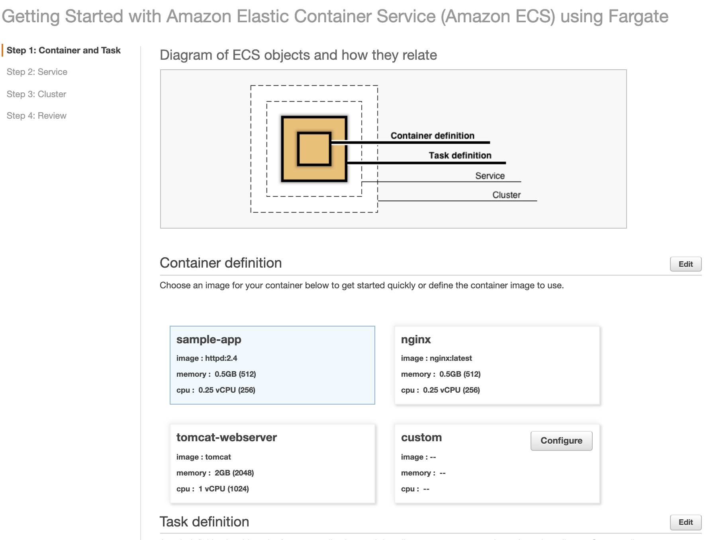
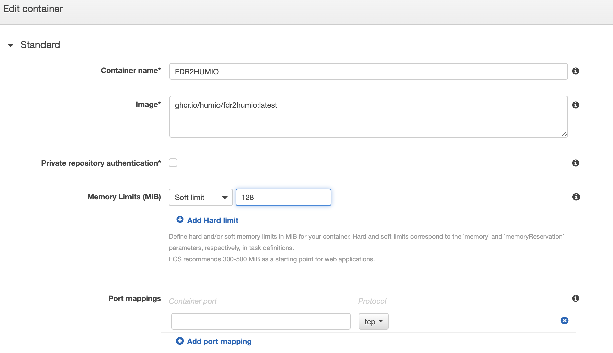
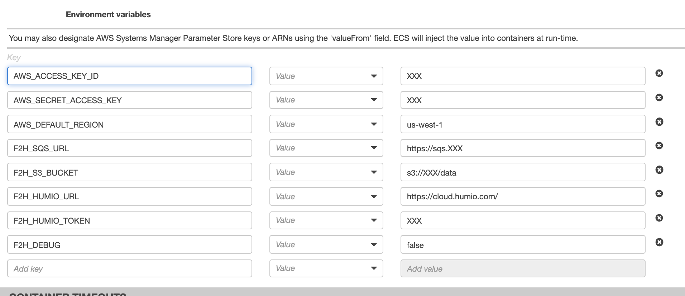
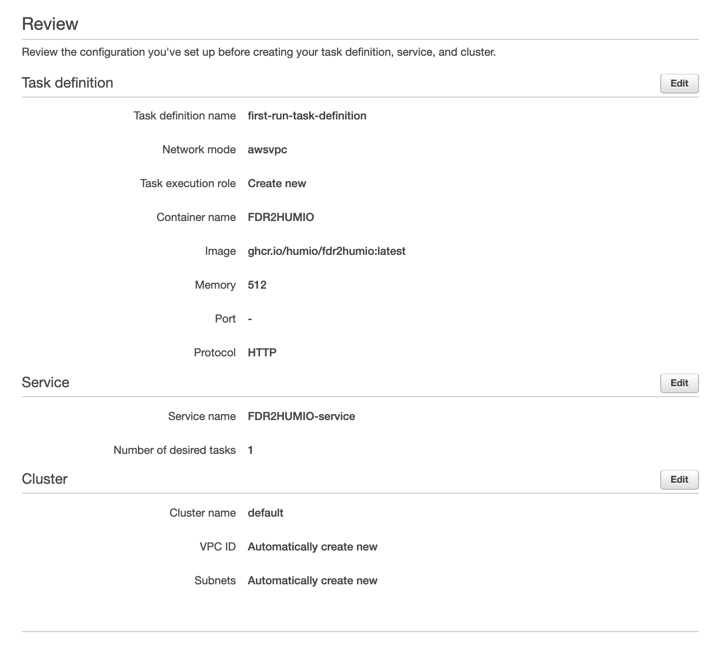
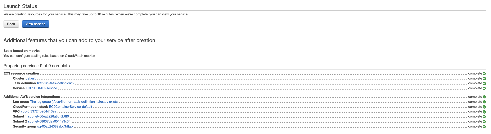
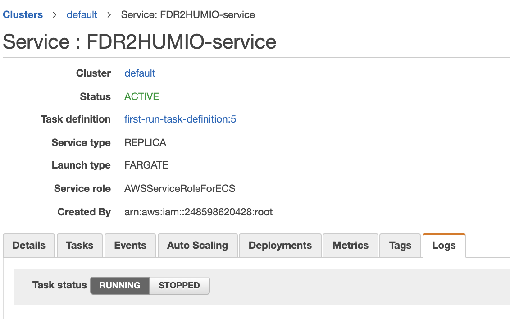

# Deploy in AWS Fargate

This document details the steps to deploy fdr2humio in Amazon Web Services using Fargate

The fdr2humio docker container is ephemeral (i.e. needs no persistent data storage) and requires no incoming network access or storage, it is therefore extremely simple to deploy and scale.

***This process uses the ECS Wizard. It will set up 1 task. Clustering and Autoscaling is available but not included in this walk through. Please refer to Amazon ECS documentation for more details on what options there are available from the Fargates service.***

## Log into the AWS Elastic console and access the Fargate Cluster Wizard

1. https://us-east-2.console.aws.amazon.com/ecs/home?region=us-east-2#/getStarted
2. Click on "Get Started"

	

4. Custom | Configure
	1. Container Name: FDR2HUMIO
	2. Image: ghcr.io/humio/fdr2humio:latest
	3. Soft Limit: 128Mb

		

	4. Advanced Container Configuration | Environment | Environment Variables
		1. AWS_ACCESS_KEY_ID=XXX
		2. AWS_SECRET_ACCESS_KEY=XXX
		3. AWS_DEFAULT_REGION=us-west-1
		4. F2H_SQS_URL=https://sqs.XXXX
		5. F2H_S3_BUCKET=s3://XXX/data
		6. F2H_HUMIO_URL=https://cloud.humio.com/
		7. F2H_HUMIO_TOKEN=XXX
		8. F2H_DEBUG=false
			***NOTE: the default region must match the SQS queue region***
			
			
			
	5. Click Update

4. Next | Next
	1. Cluster Name: default	

5. Next | Create

	
	

## Validate and Monitor FDR2HUMIO container operations
1. After the Service is deployed, this will take a few minutes, click "View Service"

	

2. Open the Logs Tab and check that logs are being shipped to Humio

	
