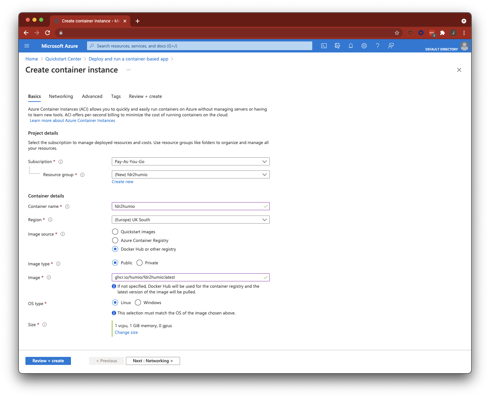
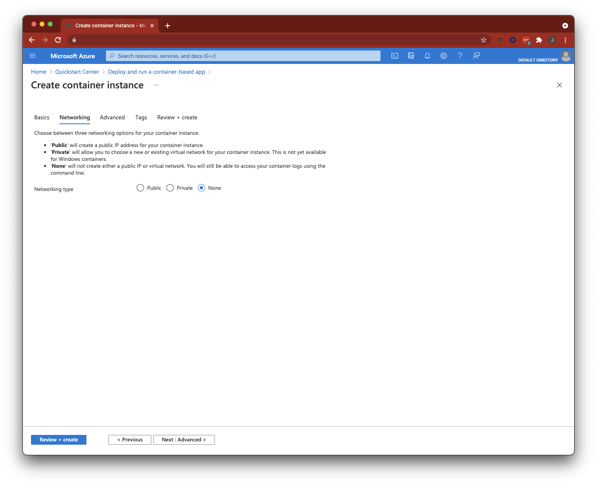
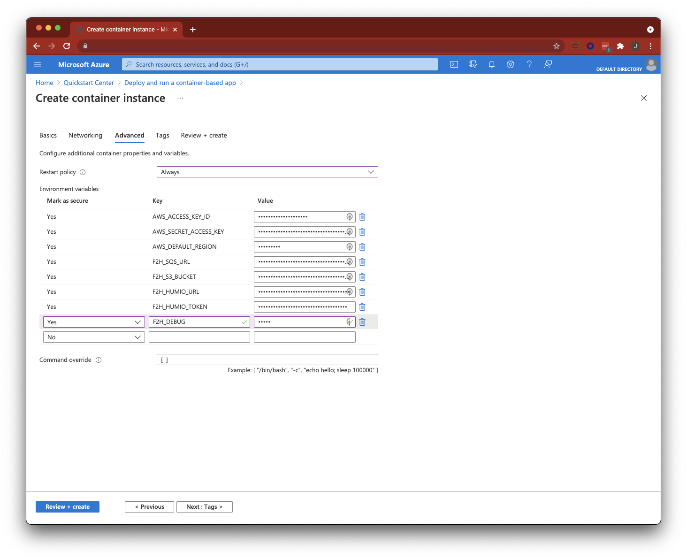
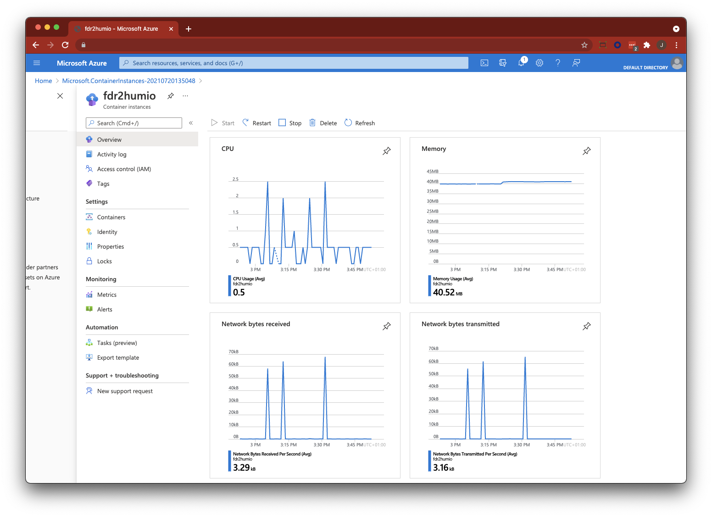

# Deploy in Azure Container Instance

This document details the steps to deploy fdr2humio in Microsoft Azure using Container Instances

Because the fdr2humio docker container is ephemeral (i.e. needs no persistent data storage) and requires no incoming network access or storage, it is therefore extremely simple to deploy and scale.

## Create Container Instance

Create a new container instance with the setting that match your usage policy (subscription, etc).

The fdr2humio specific settings are:

### Basics

| Item | Value |
| ------------ | ------------------------------------------------------------ |
| Image source | `Docker Hub or other registry`                               |
| Image type   | `Public`                                                     |
| Image        | `ghcr.io/humio/fdr2humio:latest`                             |
| OS type      | `Linux`                                                      |
| Size         | `1 vcpu, 1GiB memory, 0 gpu` (this can almost certainly be scaled smaller, but it's a safe place to start) |



### Networking

This container does not need any ingress at all, so we can disable networking.

| Item            | Value  |
| --------------- | ------ |
| Networking type | `none` |



### Advanced

This is the section where we can set the environment variables that configure the container. It is recommended to choose “Mark as Secure” for all configuration options to prevent the settings being visible outside of the container; at a minimum the `AWS_SECRET_ACCESS_KEY` and `F2H_HUMIO_TOKEN` must be set as secure as these should be treated as passwords.

You will want to set all of the following variables, with example values shown in the table below. These values are available in the CrowdStrike Falcon Console and your Humio environment.

| Variable                | Example Value                                                |
| ----------------------- | ------------------------------------------------------------ |
| `AWS_ACCESS_KEY_ID`     | `ABCDEFGHIJKLMNOP`                                           |
| `AWS_SECRET_ACCESS_KEY` | `aBcDeFgHiJkLmN/123456789abcdefghijk123456789`               |
| `AWS_DEFAULT_REGION`    | `us-west-3`                                                  |
| `F2H_SQS_URL`           | `https://sqs.us-west-3.amazonaws.com/1234567890/your-fdr-ident-12345-1234567890` |
| `F2H_S3_BUCKET`         | `S3://your-fdr-ident-12345-1234567890/data`                  |
| `F2H_HUMIO_URL`         | `https://cloud.humio.com/`                                   |
| `F2H_HUMIO_TOKEN`       | `11111111-2222-aaaa-bbbb-333333333333`                       |
| `F2H_DEBUG`             | `false`                                                      |



### Review and Create

Review the instance configuration and create the instance. Azure will start the deployment and you can monitor the progress of your job. Once it completes you should validate the service is running correctly.


## Validate and Monitor

Once your container is successfully deployed you should review the logs to confirm that it is processing events without issue.

The logs should look something like this (with debug off):

```
2021-07-20 09:15:02 INFO     Found credentials in environment variables.
2021-07-20 09:15:03 INFO     {'Attributes': {'ApproximateNumberOfMessages': '0', 'ApproximateNumberOfMessagesNotVisible': '0'}, 'ResponseMetadata': {'RequestId': '6e6742fd-d484-4f7b-b6ff-0c1b4a05b238', 'HTTPStatusCode': 200, 'HTTPHeaders': {'x-amzn-requestid': '6e6742fd-d484-4f7b-b6ff-0c1b4a05b238', 'date': 'Tue, 20 Jul 2021 09:15:03 GMT', 'content-type': 'text/xml', 'content-length': '446'}, 'RetryAttempts': 0}}
2021-07-20 09:20:57 INFO     1 file(s) of 1 shipped to Humio (2690230 bytes of 2690230) from 2021-07-20 09:20:52.426000
2021-07-20 09:26:45 INFO     1 file(s) of 1 shipped to Humio (2119130 bytes of 2119130) from 2021-07-20 09:26:41.184000
2021-07-20 09:32:37 INFO     1 file(s) of 1 shipped to Humio (2222584 bytes of 2222584) from 2021-07-20 09:32:32.317000
2021-07-20 09:38:51 INFO     1 file(s) of 1 shipped to Humio (2404796 bytes of 2404796) from 2021-07-20 09:38:46.719000
2021-07-20 09:45:11 INFO     1 file(s) of 1 shipped to Humio (1056 bytes of 1056) from 2021-07-20 09:45:09.373000
2021-07-20 09:45:58 INFO     1 file(s) of 1 shipped to Humio (2787707 bytes of 2787707) from 2021-07-20 09:45:53.505000
2021-07-20 09:50:35 INFO     1 file(s) of 1 shipped to Humio (350 bytes of 350) from 2021-07-20 09:50:34.032000
2021-07-20 09:50:53 INFO     1 file(s) of 1 shipped to Humio (945 bytes of 945) from 2021-07-20 09:50:52.417000
2021-07-20 09:52:31 INFO     1 file(s) of 1 shipped to Humio (31103 bytes of 31103) from 2021-07-20 09:52:29.606000
2021-07-20 09:53:36 INFO     1 file(s) of 1 shipped to Humio (2357370 bytes of 2357370) from 2021-07-20 09:53:31.180000
2021-07-20 09:59:22 INFO     1 file(s) of 1 shipped to Humio (2365363 bytes of 2365363) from 2021-07-20 09:59:17.003000
2021-07-20 10:05:59 INFO     1 file(s) of 1 shipped to Humio (2348701 bytes of 2348701) from 2021-07-20 10:05:54.293000
2021-07-20 10:12:26 INFO     1 file(s) of 1 shipped to Humio (2135982 bytes of 2135982) from 2021-07-20 10:12:21.810000
2021-07-20 10:15:54 INFO     1 file(s) of 1 shipped to Humio (344 bytes of 344) from 2021-07-20 10:15:52.820000
2021-07-20 10:15:56 INFO     1 file(s) of 1 shipped to Humio (674 bytes of 674) from 2021-07-20 10:15:54.863000
...

```

Azure also provides good monitoring for the container services. You should see something like this:


